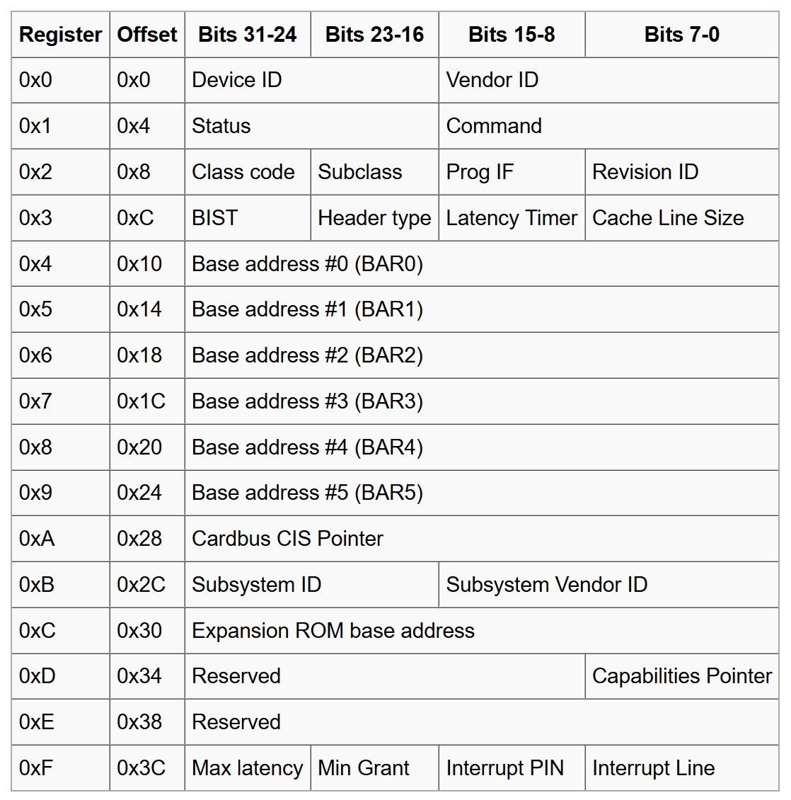

# lab 6

## PCI介绍

### 硬件

PCI（Peripheral Component Interconnect）是本地计算机总线，用于连接计算机中的硬件设备。PCI如下图，主要分为三个部分：

1. PCI设备：符合 PCI 总线标准的设备就被称为 PCI 设备，PCI 总线架构中可以包含多个 PCI 设备。图中的 Audio、LAN 都是一个 PCI 设备。PCI 设备同时也分为主设备和目标设备两种，主设备是一次访问操作的发起者，而目标设备则是被访问者。
2. PCI总线：PCI 总线在系统中可以有多条，类似于树状结构进行扩展，每条 PCI 总线都可以连接多个 PCI 设备/桥，上图中有两条 PCI 总线。
3. PCI桥：当一条 PCI 总线的承载量不够时，可以用新的 PCI 总线进行扩展，而 PCI 桥则是连接 PCI 总线之间的纽带，如图的 PCI-to-PCI Bridge 。还有比如兼容其他设备的PCI-to-ISA Bridge。

Host bridge直接产生一条PCI总线，为0号PCI总线。该总线还可以通过PCI桥拓展出其他总线。最终形成一个PCI树结构。

### 软件

PCI设备可以通过8bit的Bus Number，5bit的Device Number和3bit的Function Number来定位，简称BDF。因此，一个host bridge最多有256个总线，每个总线可有32个设备，多功能设备还支持8个子设备。

每个设备都有自己的配置空间，总共256 字节。可以通过 IO 端口 `CONFIG_ADDRESS`（0xCF80） 和 `CONFIG_DATA`（0xCFC） 读取 PCI 配置空间。`CONFIG_ADDRESS `寄存器格式：

| Bit 31     | Bits 30-24 | Bits 23-16 | Bits 15-11    | Bits 10-8       | Bits 7-0        |
| ---------- | ---------- | ---------- | ------------- | --------------- | --------------- |
| Enable Bit | Reserved   | Bus Number | Device Number | Function Number | Register Offset |

ps： Offset必须指向连续的DWORD，即第1:0位总是00（它们仍然是寄存器Offset的一部分）。

读写PCI配置空间的流程：

1. `out`写入 `CONFIG_ADDRESS`，通过BDF指定访问设备，并通过8位offset来定位配置空间的数据位置。
2. 通过 `in/out`从 `CONFIG_DATA`读写配置空间数据。

对于普通设备来说，256byte的配置空间如下图：

### JOS流程

首先从0号bus开始，遍历0-31号设备和0-8号功能。如果设备是bridge，就遍历递归子树结构。如果是E1000设备，就进行初始化。
