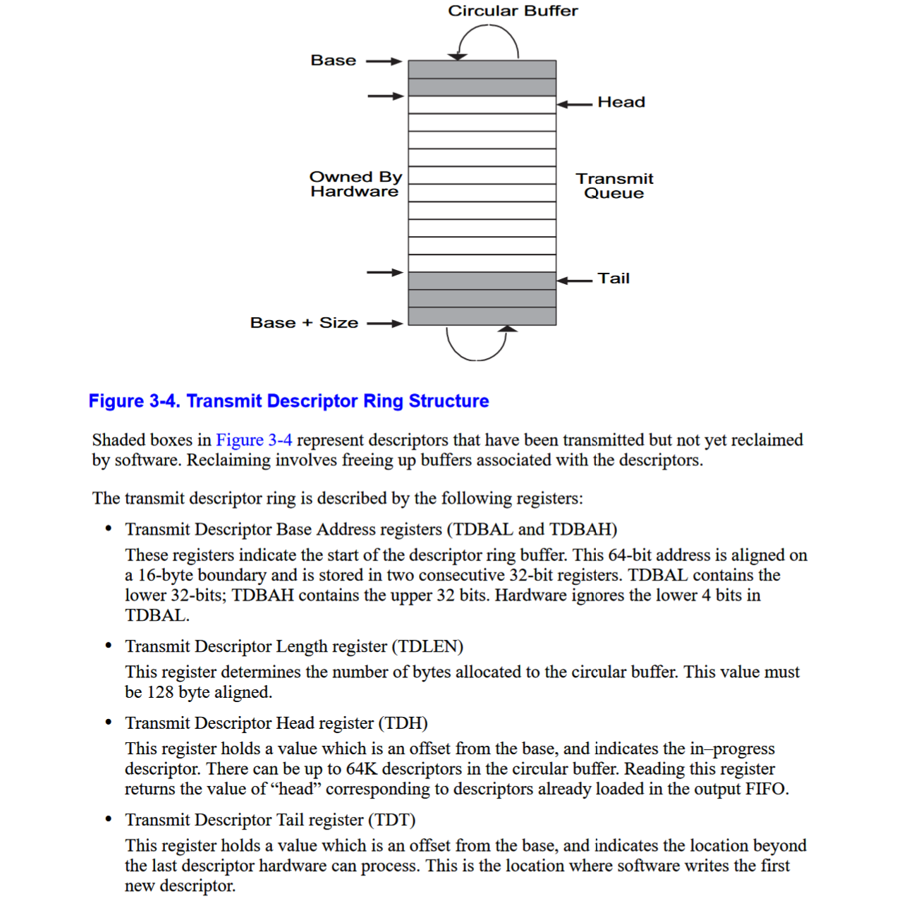

# lab 6

## PCI介绍

### 硬件

PCI（Peripheral Component Interconnect）是本地计算机总线，用于连接计算机中的硬件设备。PCI如下图，主要分为三个部分：


1. PCI设备：符合 PCI 总线标准的设备就被称为 PCI 设备，PCI 总线架构中可以包含多个 PCI 设备。图中的 Audio、LAN 都是一个 PCI 设备。PCI 设备同时也分为主设备和目标设备两种，主设备是一次访问操作的发起者，而目标设备则是被访问者。
2. PCI总线：PCI 总线在系统中可以有多条，类似于树状结构进行扩展，每条 PCI 总线都可以连接多个 PCI 设备/桥，上图中有两条 PCI 总线。
3. PCI桥：当一条 PCI 总线的承载量不够时，可以用新的 PCI 总线进行扩展，而 PCI 桥则是连接 PCI 总线之间的纽带，如图的 PCI-to-PCI Bridge 。还有比如兼容其他设备的PCI-to-ISA Bridge。

Host bridge直接产生一条PCI总线，为0号PCI总线。该总线还可以通过PCI桥拓展出其他总线。最终形成一个PCI树结构。

PCI设备包括两类空间，一种是配置空间， CPU不能直接访问，访问这个空间，需要借助BIOS功能;另一种是普通的控制寄存器空间，这部分经过映射后，CPU可以直接访问控制。

### 软件

PCI设备可以通过8bit的Bus Number，5bit的Device Number和3bit的Function Number来定位，简称BDF。因此，一个host bridge最多有256个总线，每个总线可有32个设备，多功能设备还支持8个子设备。

每个设备都有自己的配置空间，总共256 字节。可以通过 IO 端口 `CONFIG_ADDRESS`（0xCF80） 和 `CONFIG_DATA`（0xCFC） 读取 PCI 配置空间。`CONFIG_ADDRESS`寄存器格式：

| Bit 31     | Bits 30-24 | Bits 23-16 | Bits 15-11    | Bits 10-8       | Bits 7-0        |
| ---------- | ---------- | ---------- | ------------- | --------------- | --------------- |
| Enable Bit | Reserved   | Bus Number | Device Number | Function Number | Register Offset |

ps： Offset必须指向连续的DWORD，即第1:0位总是00（它们仍然是寄存器Offset的一部分）。

读写PCI配置空间的流程：

1. `out`写入 `CONFIG_ADDRESS`，通过BDF指定访问设备，并通过8位offset来定位配置空间的数据位置。
2. 通过 `in/out`从 `CONFIG_DATA`读写配置空间数据。

对于普通设备来说，256byte的配置空间如下图：


一共有6个BAR（Base Address Registers ）。BAR可用于保存设备使用的内存地址，或端口地址的偏移量。通常，内存地址BAR需要位于物理内存中，而I/O空间BAR可以驻留在任何内存地址（甚至超出物理内存）。

Memory Space BAR layout：

| Bits 31-4                    | Bit 3        | Bits 2-1 | Bit 0    |
| ---------------------------- | ------------ | -------- | -------- |
| 16-Byte Aligned Base Address | Prefetchable | Type     | Always 0 |

I/O Space BAR Layout：

| Bits 31-2                   | Bit 1    | Bit 0    |
| --------------------------- | -------- | -------- |
| 4-Byte Aligned Base Address | Reserved | Always 1 |

Memory Space BAR Layout 的 Type 字段指定BAR的大小以及它在内存中的映射位置。如果它的值为0x0，则基址寄存器为 32 位宽，可以映射到 32 位内存空间中的任何位置。值 0x2 表示基址寄存器为 64 位宽，可以映射到 64位内存空间中的任何位置（一个 64 位基址寄存器占用 2 个可用的基址寄存器）。
空间的大小可以用如下方法读取：

1. 向寄存器写 0xFFFFFFFF；
2. 读出寄存器的值，并取反；
3. 再加 1 就是该空间的大小。

### JOS流程

首先从0号bus开始，遍历0-31号设备和0-8号功能。如果设备是bridge，就遍历递归子树结构。如果是E1000设备，就进行初始化。

### E1000

E1000是英特尔的网卡设备，连接在PCI总线上。E1000支持DMA，硬件会自动从环形队列中写入和发送数据。环形队列的空间由软件管理，只需要告诉给E1000队列的起始地址、长度、head、tail，然后软件每次修改tail，插入数据。

E1000会自动从发送队列的head处开始读取数据发送。发送队列的结构，配置队列的寄存器如图所示：



每个队列项是一个描述符结构：

```c
63            48 47   40 39   32 31   24 23   16 15             0
  +---------------------------------------------------------------+
  |                         Buffer address                        |
  +---------------+-------+-------+-------+-------+---------------+
  |    Special    |  CSS  | Status|  Cmd  |  CSO  |    Length     |
  +---------------+-------+-------+-------+-------+---------------+
```

buffer和length分别是描述符指向的缓冲区的物理地址和大小。每次设备会从缓冲区中发送数据。

发送缓冲区初始化流程为：

1. 分配一块内存用作发送描述符队列，起始地址要16字节对齐。用基地址(TDBAL/TDBAH)寄存器。
2. 设置(TDLEN)寄存器，该寄存器保存发送描述符队列长度，必须128字节对齐。
3. 设置(TDH/TDT)寄存器，这两个寄存器都是发送描述符队列的下标。分别指向头部和尾部。应该初始化为0。
4. 初始化TCTL寄存器。设置TCTL.EN位为1，设置TCTL.PSP位为1。设置TCTL.CT为10h。设置TCTL.COLD为40H
    设置TIPG寄存器

> 但是，传输队列只有这么大。如果卡落后于传输数据包并且传输队列已满，会发生什么？为了检测这种情况，您需要 E1000 的一些反馈。不幸的是，您不能只使用 TDH（传输描述符头）寄存器；该文档明确指出，从软件中读取此寄存器是不可靠的。但是，如果您在传输描述符的命令字段中设置 RS 位，则当卡发送该描述符中的数据包时，卡将在描述符的状态字段中设置 DD 位。如果设置了描述符的 DD 位，则您知道回收该描述符并使用它来传输另一个数据包是安全的。

说明不能读取head来判断队列是否已满。描述符设置RS bit，这样就能从DD bit判断这个描述符是已经传输完成。从而如果当前tail上的描述符没有DD置位，就说明队列满了。这种时候可以选择简单地丢弃数据，并在软件层面返回错误给上层。
