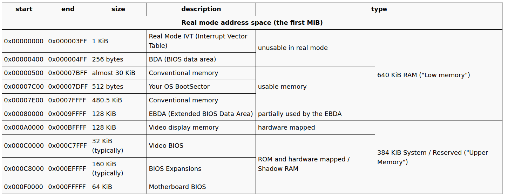
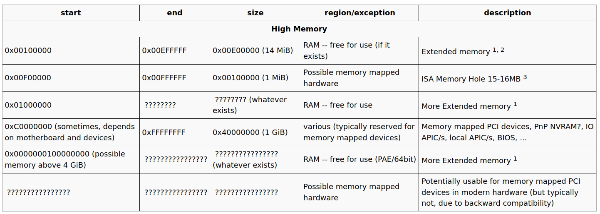

#lab 2

entry.S中，临时的虚实地址映射为[0, 4M) => [0, 4M)， [0xF0000000, 0xF0000000+4M) => [0, 4M)。4M正好是一个page directory映射的内存大小。

在物理内存中，

- `[0, PGSIZE)`包含BIOS中断表之类的信息，不可用于分配
- `[PGSIZE, 0xA0000)`可自由分配
- `[0xA0000, 0x100000)`为硬件相关的内存，不可分配
- `[0x100000, end + boot_allocated_pages)`为内核加载的内存地址，不可分配 (别忘记在`page_alloc`启用前，通过`boot_alloc`分配的页！！)
- `[end + boot_allocated_pages, MAX_PADDR]`为自由分配

---

空闲页链表free_page_list需要重排，让[0, 4M)的内存优先分配。经过运行测试，有836个空闲页框是在`[0, 4M)`范围内。这些页在`page_alloc`之后能够正常使用，因为在一开始的`entrypgdir`里已经映射过。

内核需要完成三块区域映射：

- pages数组的映射
  
  `[UPAGES, UPAGES + sizeof(pages)) =>  [phyaddr(pages), phyaddr(pages)+sizeof(pages))`。映射`pages`数组到`UPAGES`，用了262144 / 4096 = 64个页框。`UPAGES`为`0xef000000`，会分配1块页框作为二级页表完成映射。

- 内核stack的映射
  
  `[bootstack, 8*PGSIZE) => [KSTACK, 8*PGSIZE)`。内核用的栈在加载的ELF的data段，符号为`bootstack`，大小为8个页框。`KSTACK`为`0xefff8000`，会分配1个页框作为二级页表。

- KERNBASE往上都映射到物理内存
  
  `[KERNBASE, 2^32) => [0, 2^32 - KERNBASE)`。`KERNBASE`为0xF0000000，完整的映射需要(0xFFFFFFFF - 0xF0000000) / 4M  = 64个页框作为二级页表。

总共分配了66个空闲页框，都能够落在[0, 4M)的映射内。

---

页表切换后映射关系如下表：

| virtual address | physical address | size | flag | remark |
| ---                     | ---                     | ---   | --- | --- |
| 0xf0000000 - 0xffffffff | 0x00000000 - 0x0fffffff | 256 M | W P | 涵盖了目前所有的物理内存（128M） |
| 0xefff8000 - 0xefffffff | 0x00110000 - 0x00117fff | 32K   | W P | 映射了内核的stack |
| 0xef000000 - 0xef03ffff | 0x0011d000 - 0x0014ffff | 256k  | W P | 映射了pags结构数组 |
